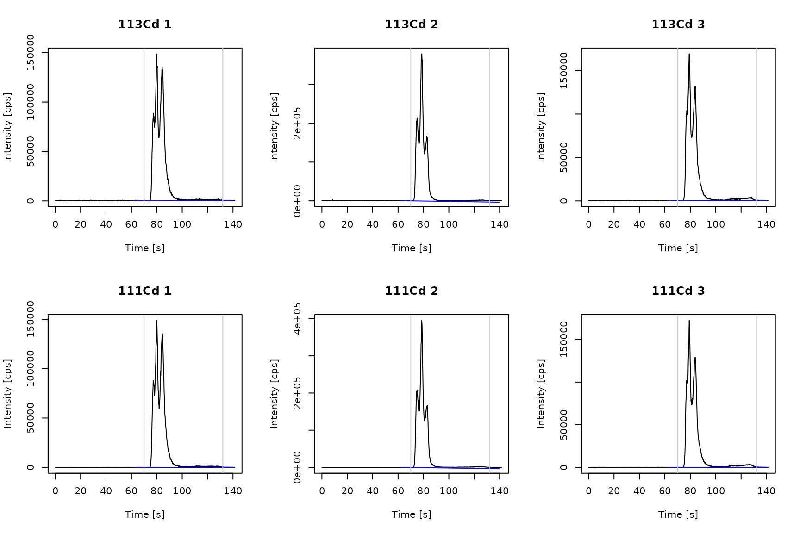
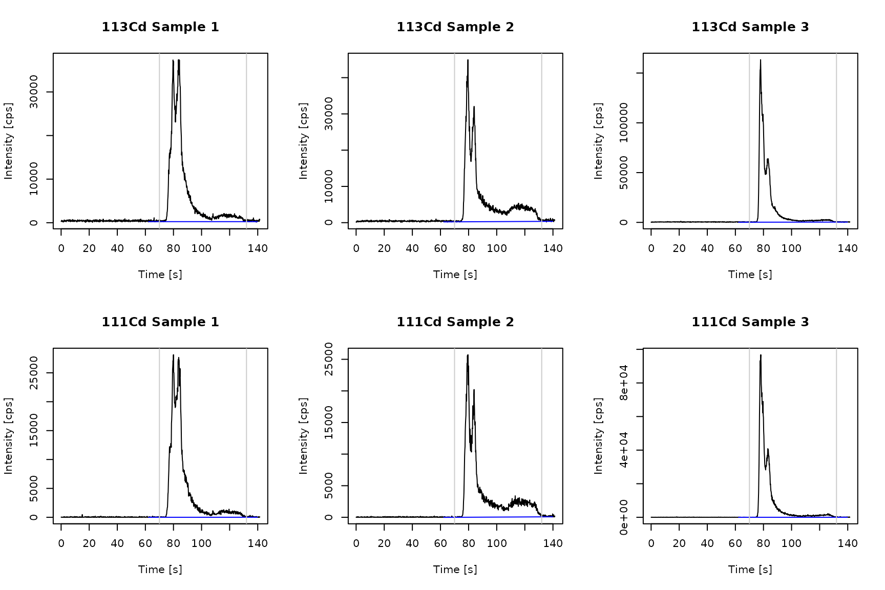

# Isotope dilution mass spectrometry (IDMS) workflow

## Introduction

IDMS has first been introduced as a calibration strategy in combination
with ETV/ICP-MS by [Vanhaecke *et
al.*](https://pubs.rsc.org/en/content/articlelanding/1997/ja/a604133g).
Using IDMS corrects non-spectral interferences, signal drifts caused by
the ICP-MS, and fluctuations in the vaporization and transport behaviour
of the ETV by mixing the sample with a known amount of a
isotopic-enriched spike of the same element. The analyte concentration
can be determined through measuring the alternated isotopic composition
of the sample. In the following, the enriched spike isotope will be
referred as **isotope 1** or **spike isotope** while **isotope 2** or
**sample isotope** denotes the isotope used for calculating the isotope
ratios.

It has to be noted that although it is possible to compute the
calculations for ICP-OES data only MS data will provide valid results.

Example measurements of Cd in a cacao reference material are provided
the *ETVapp* package and can be accessed through the library.

``` r

library(ETVapp)
wf <- "IDMS"
td <- ETVapp::ETVapp_testdata[[wf]]
```

## Mass bias

The transmission of ions is influenced in regard to their mass during
ionization, passing the ion optics, mass separation and detection. To
correct the mass bias, a correction factor *K* is determined by the
analysis of a sample (or standard) without spike addition \[JL: but
below you extract the spike isotope?? VS: the spike isotope is part of
the natural isotopic composition and enriched in the spike material\].
The package provides a triplicate sample measurement for this purpose
which will be imported through the following code.

``` r

mb_imp <- td[['Massbias']]
str(mb_imp[[1]])
#> 'data.frame':    905 obs. of  6 variables:
#>  $ Time : num  0.032 0.188 0.345 0.501 0.658 ...
#>  $ 113Cd: num  333 400 433 300 467 ...
#>  $ 111Cd: num  0 0 33.3 0 0 ...
#>  $ 80Se : num  52129499 54426407 55438831 57534650 54088225 ...
#>  $ 115In: num  2634 2400 2734 2800 2400 ...
#>  $ 118Sn: num  1533 1567 1767 1433 2267 ...
```

Calling the function
[`get_isoratio()`](https://janlisec.github.io/ETVapp/reference/get_isoratio.md)
will compute the isotope ratio of the spike to the sample isotope based
on peak areas.

``` r

iso1 <- "113Cd"
iso2 <- "111Cd"
ps <- 70
pe <- 132
PPmethod <- "Peak (manual)"

mb_peaks <- get_isoratio(
    data = mb_imp, 
    iso1_col = iso1, 
    iso2_col = iso2, 
    PPmethod = PPmethod, 
    peak_start = ps, 
    peak_end = pe
)

gt::gt(mb_peaks)
```

| Spike isotope | Sample isotope | R_m       |
|---------------|----------------|-----------|
| 113Cd         | 111Cd          | 1.0100925 |
| 113Cd         | 111Cd          | 0.9941966 |
| 113Cd         | 111Cd          | 1.0043960 |

The following code will plot the time scans of the spike and sample
isotope. The grey vertical lines mark the peak integration range. The
baseline is drawn in blue.

``` r

time_col <- "Time"
cf <- 50

mb_pro <- process_data(data = mb_imp, wf = wf, c1 = iso1, c2 = iso2, fl = NULL)

mb_BL <- lapply(1:length(mb_pro), function(i) {
  flt <- (min(which(mb_pro[[i]][,time_col]>=ps))-cf):(max(which(mb_pro[[i]][,time_col]<=pe))+cf)
  ETVapp:::blcorr_col(
    df = mb_pro[[i]][flt,c(time_col, iso1, iso2)],
    nm = iso1, 
    BLmethod = "modpolyfit",
    rval = "baseline", 
    amend = "_BL")
})

mb_BL <- lapply(1:length(mb_BL), function(i) {
  ETVapp:::blcorr_col(
    df = mb_BL[[i]],
    nm = iso2, 
    BLmethod = "modpolyfit",
    rval = "baseline", 
    amend = "_BL")
})

mb_no <- seq(1,3,1)
par(mfrow=c(2,3))
for (i in 1:3) {
  plot(mb_pro[[i]][,c("Time")], mb_pro[[i]][,iso1], type="l", 
       ylab = "Intensity [cps]", xlab = "Time [s]", main = paste(iso1, mb_no[i]))
  lines(x = mb_BL[[i]][,c("Time")], y = mb_BL[[i]][,c("113Cd_BL")], col = "blue")
  abline(v=c(ps,pe), col=grey(0.8))
}
for (i in 1:3) {
  plot(mb_pro[[i]][,c("Time")], mb_pro[[i]][,iso2], type="l", 
       ylab = "Intensity [cps]", xlab = "Time [s]", main = paste(iso2, mb_no[i]))
  lines(x = mb_BL[[i]][,c("Time")], y = mb_BL[[i]][,c("111Cd_BL")], col = "blue")
  abline(v=c(ps,pe), col=grey(0.8))
}
```



The mass discrimination factor *K* is defined as the measured isotope
ratio to the true value. The following code will calculate *K* for every
mass bias measurement. Select a *K* value or compute the mean value for
further calculations (recommended).

``` r

(K <- calc_massbias(
  mb_peaks[,"R_m"], 
  As_iso1 = 12.22, 
  As_iso2 = 12.8
))
#> [1] 0.9451486 0.9602603 0.9505091
```

## IDMS

Calculate the isotope ratios of IDMS sample measurements containing
spike solution.

``` r

samp_imp <- td[['Samples']]

samp_peaks <- get_isoratio(
  data = samp_imp, 
  iso1_col = iso1, 
  iso2_col = iso2, 
  PPmethod = PPmethod, 
  peak_start = ps, 
  peak_end = pe
)

gt::gt(samp_peaks)
```

| Spike isotope | Sample isotope | R_m      |
|---------------|----------------|----------|
| 113Cd         | 111Cd          | 1.350613 |
| 113Cd         | 111Cd          | 1.660905 |
| 113Cd         | 111Cd          | 1.654790 |

Plot the sample time scans with the peak parameter for each isotope.

``` r

samp_pro <- process_data(data =samp_imp, wf = wf, c1 = iso1, c2 = iso2, fl = NULL)

samp_BL <- lapply(1:length(mb_pro), function(i) {
  flt <- (min(which(samp_pro[[i]][,time_col]>=ps))-cf):(max(which(samp_pro[[i]][,time_col]<=pe))+cf)
  ETVapp:::blcorr_col(
    df = samp_pro[[i]][flt,c(time_col, iso1, iso2)],
    nm = iso1, 
    BLmethod = "modpolyfit",
    rval = "baseline", 
    amend = "_BL")
})

samp_BL <- lapply(1:length(samp_BL), function(i) {
  ETVapp:::blcorr_col(
    df = samp_BL[[i]],
    nm = iso2, 
    BLmethod = "modpolyfit",
    rval = "baseline", 
    amend = "_BL")
})

samp_no <- seq(1,3,1)
par(mfrow=c(2,3))
for (i in 1:3) {
  plot(samp_pro[[i]][,c("Time")], samp_pro[[i]][,iso1], type="l", 
       ylab = "Intensity [cps]", xlab = "Time [s]", main = paste(iso1,  "Sample", samp_no[i]))
  lines(x = samp_BL[[i]][,c("Time")], y = samp_BL[[i]][,"113Cd_BL"], col = "blue")
  abline(v=c(ps,pe), col=grey(0.8))
}
for (i in 1:3) {
  plot(samp_pro[[i]][,c("Time")], samp_pro[[i]][,iso2], type="l", 
       ylab = "Intensity [cps]", xlab = "Time [s]", main = paste(iso2, "Sample", samp_no[i]))  #lines(mb_pro[[i]][,c("Time")], mb_pro[[i]][,c("111Cd")], col=3)
  lines(x = samp_BL[[i]][,c("Time")], y = samp_BL[[i]][,"111Cd_BL"], col = "blue")
  abline(v=c(ps,pe), col=grey(0.8))
}
```



The amount of added spike and the analyte mass is computed through the
IDMS equation. The function
[`tab_result()`](https://janlisec.github.io/ETVapp/reference/tab_result.md)
will output the result table. The input of a mass fraction allows for
result calculation if the elemental composition of the analyte is not
fully captured by the acquired element,*e.g.* Sn in organo tin compounds
or C in micro plastics.

``` r

N_sp <- calc_N_sp(c_sp = 2.5, V_sp = 6, VF1 = 1000, M_sp = 113.01, M_sa = 112.41)
amae <- calc_analyte_mass_as_element(R_m = samp_peaks[,"R_m"], K = mean(K), Asp_iso1 = 92.61, Asp_iso2 = 0.22, As_iso1 = 12.22, As_iso2 = 12.8, N_sp = N_sp)

gt::gt(tab_result(
  peak_data = samp_peaks, 
  wf = wf, 
  K = mean(K), 
  amae = amae
))
```

| Spike isotope | Sample isotope | R_m | R_corr | Analyte mass as element \[pg\] | Sample mass \[mg\] | Content as element \[ppb\] |
|----|----|----|----|----|----|----|
| 113Cd | 111Cd | 1.350613 | 1.285747 | 0.3250818 | 1 | 0.3250818 |
| 113Cd | 111Cd | 1.660905 | 1.581136 | 0.1716753 | 1 | 0.1716753 |
| 113Cd | 111Cd | 1.654790 | 1.575314 | 0.1732879 | 1 | 0.1732879 |

## Limits of detection and quantification

The limit of detection (LOD) and quantification (LOQ) are estimated from
blank measurements containing spike. Perform import and isotope ratio
calculations of integrated the blank signals in the peak time window as
follows. The blank measurements provided in the *ETVapp* package are
identical to the sample measurements and are included for demonstration
purposes.

``` r

blk_imp <- td[['Blanks']]

blk_peaks <- get_isoratio(
  blk_imp, 
  iso1_col = iso1, 
  iso2_col = iso2, 
  PPmethod = PPmethod, 
  peak_start = ps, 
  peak_end = pe
)

gt::gt(blk_peaks)
```

| Spike isotope | Sample isotope | R_m      |
|---------------|----------------|----------|
| 113Cd         | 111Cd          | 1.350613 |
| 113Cd         | 111Cd          | 1.660905 |
| 113Cd         | 111Cd          | 1.654790 |

Analog to sample measurements, a (theoretical) analyte mass is computed
for each blank measurement.

``` r

LOX_df <- tab_result(
  peak_data = blk_peaks, 
  wf = wf, 
  K = mean(K), 
  amae = amae
)

gt::gt(LOX_df)
```

| Spike isotope | Sample isotope | R_m | R_corr | Analyte mass as element \[pg\] | Sample mass \[mg\] | Content as element \[ppb\] |
|----|----|----|----|----|----|----|
| 113Cd | 111Cd | 1.350613 | 1.285747 | 0.3250818 | 1 | 0.3250818 |
| 113Cd | 111Cd | 1.660905 | 1.581136 | 0.1716753 | 1 | 0.1716753 |
| 113Cd | 111Cd | 1.654790 | 1.575314 | 0.1732879 | 1 | 0.1732879 |

Generate the LOD and LOQ result table. An input *data.frame* with at
least three entries in rows is required for calculation of the standard
deviation.

``` r

gt::gt(tab_LOX(x = LOX_df[,"R_corr"], wf = wf))
#> At least ten blank values are recommended for estimating the LOD and LOQ.
```

| LOD as element \[pg\] | LOQ as element \[pg\] | Sample mass \[mg\] | LOD per sample mass \[ppb\] | LOQ per sample mass \[ppb\] |
|----|----|----|----|----|
| 0.5066622 | 1.688874 | 1 | 0.5066622 | 1.688874 |
