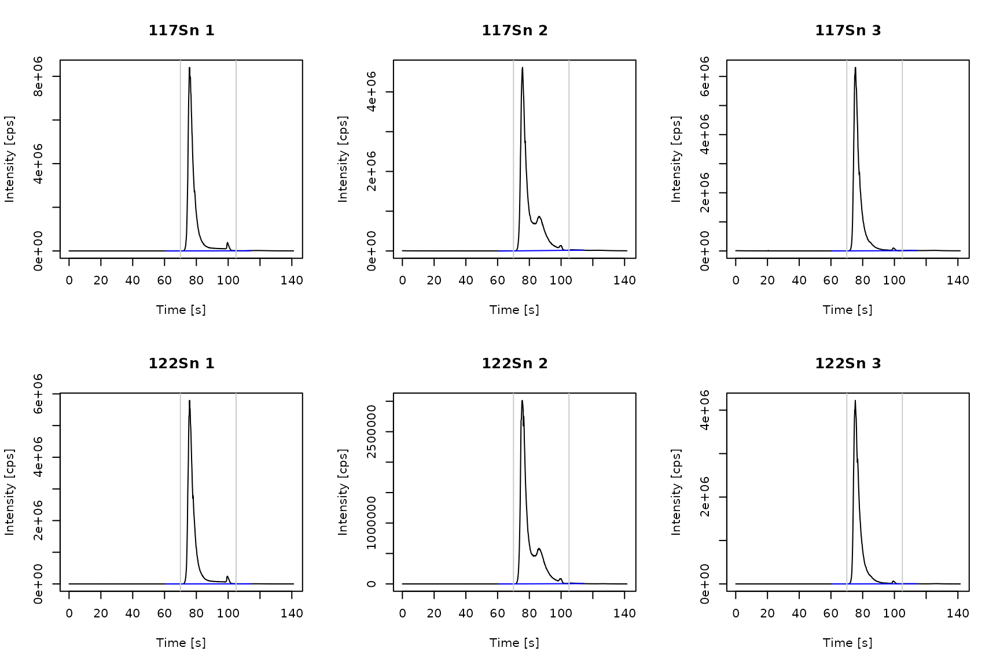
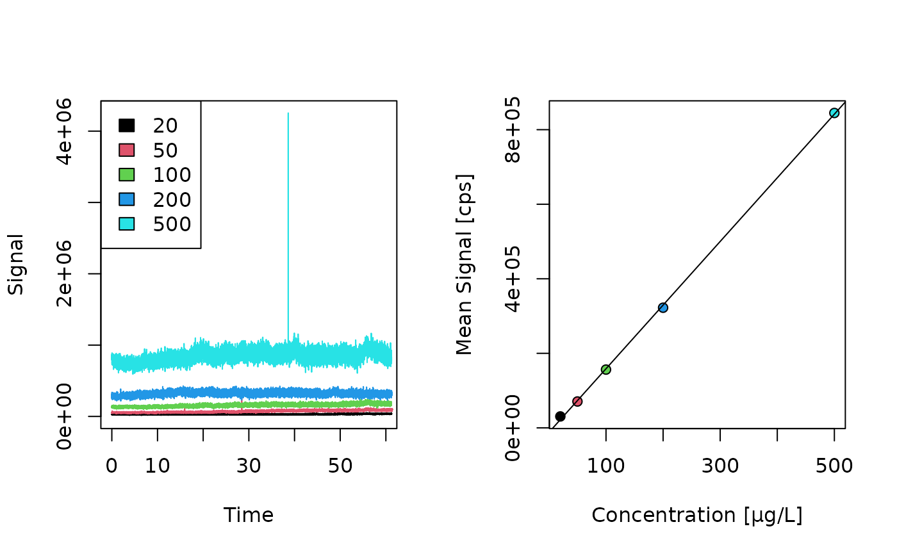
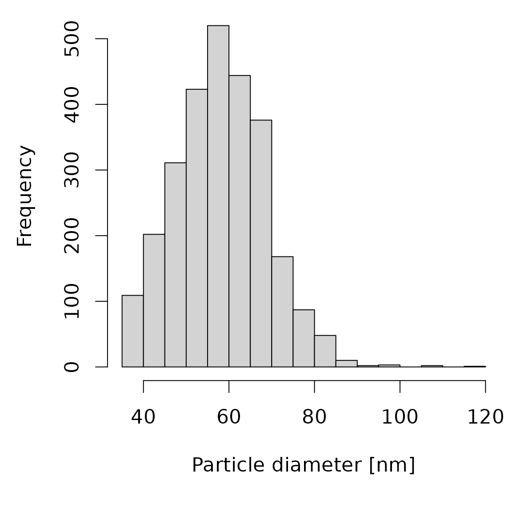
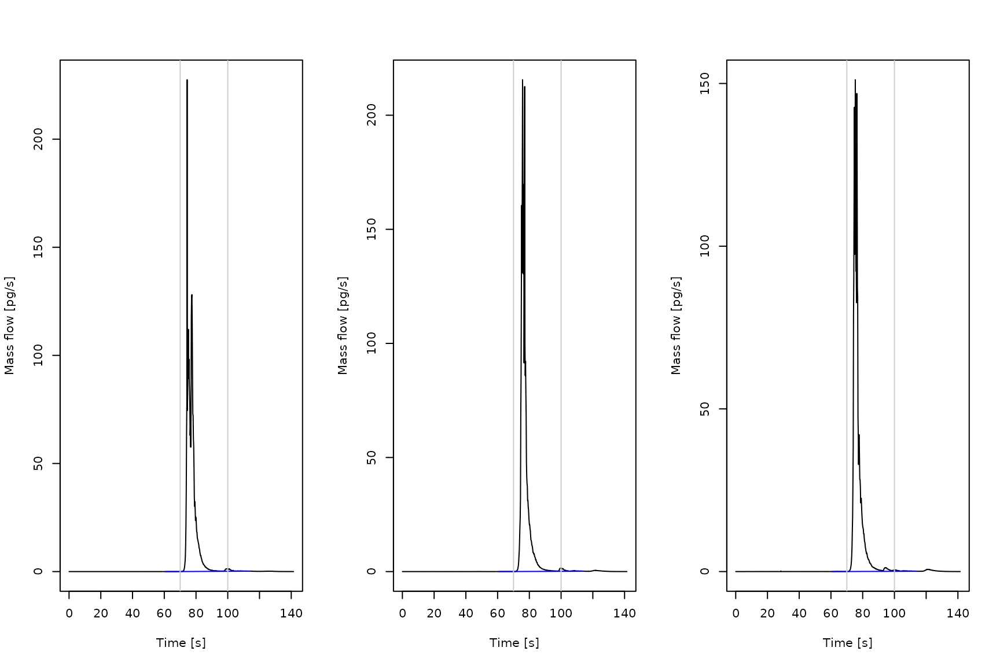
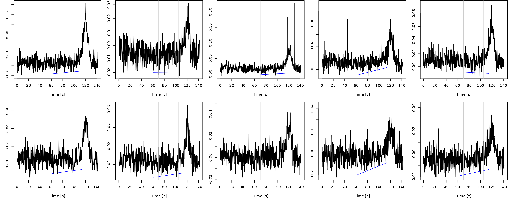

# On-line isotope dilution mass spectrometry (oIDMS) workflow

## Introduction

On-line IDMS is a variation of IDMS. The isotope-enriched spike is not
mixed with sample prior to a separation technique but continuously added
before the mass spectrometer. This provides the advantage of using a
species ­ unspecific spike since the spike does not undergo the same
treatment as the sample. For ETV measurements, on-line IDMS enables
utilizing a spike with a different vaporization behavior to the analyte
and automatizes the spike introduction.

This workflow describes the data treatment for on-line IDMS based on a
[published on-line ETV/ICP-IDMS
approach](https://link.springer.com/article/10.1007/s00216-025-06064-y).
The spike aerosol was generated through a low-flow nebulizer and merged
with the ETV sample aerosol in a modified cyclonic spray chamber prior
to ionization in the plasma. In the following, the enriched spike
isotope will be referred as **isotope 1** or **spike isotope** while
**isotope 2** or **sample isotope** denotes the isotope used for
calculating the isotope ratios.

It has to be noted that although it is possible to compute the
calculations for ICP-OES data only MS data will provide valid results.

Example measurements of tin in a sediment reference material are
provided the *ETVapp* package and can be accessed through the library.

``` r

library(ETVapp)
wf <- "oIDMS"
td <- ETVapp::ETVapp_testdata[[wf]]
```

## Mass bias

The transmission of ions is influenced in regard to their mass during
ionization, passing the ion optics, mass separation and detection. To
correct the mass bias, a correction factor *K* is determined by the
analysis of a sample (or standard) without spike addition. The package
provides a triplicate measurement of the reference material. The
following code will import the raw data files, calculate the isotope
ratios based on the peak areas and return *K* for each input data.

``` r

mb_imp <- td[["Massbias"]]
str(mb_imp[[1]])
#> 'data.frame':    752 obs. of  7 variables:
#>  $ Time : num  0.032 0.22 0.407 0.595 0.783 ...
#>  $ 117Sn: num  100 233.3 166.7 100 33.3 ...
#>  $ 122Sn: num  33.3 0 33.3 0 0 ...
#>  $ 80Se : num  4152171 4037625 4125285 4260275 4040985 ...
#>  $ 124Sn: num  33.3 66.7 66.7 33.3 0 ...
#>  $ 121Sb: num  1767 1600 2000 1833 1900 ...
#>  $ 125Te: num  0 33.3 33.3 0 100 ...

iso1 <- "117Sn"
iso2 <- "122Sn"
abnd1 <- 7.68
abnd2 <- 4.63
ps <- 70
pe <- 105

mb_peaks <- get_isoratio(
  data = mb_imp, 
  iso1_col = iso1, 
  iso2_col = iso2,
  PPmethod = "Peak (manual)", 
  peak_start = ps, 
  peak_end = pe
)
#> Warning: Different peak boundaries for the isotopes found. Please check the
#> integration. Complete peak integration is necessary for an accurate isotope
#> ratio determination.
#> Warning: Different peak boundaries for the isotopes found. Please check the
#> integration. Complete peak integration is necessary for an accurate isotope
#> ratio determination.
#> Warning: Different peak boundaries for the isotopes found. Please check the
#> integration. Complete peak integration is necessary for an accurate isotope
#> ratio determination.

gt::gt(mb_peaks)
```

| Spike isotope | Sample isotope | R_m      |
|---------------|----------------|----------|
| 117Sn         | 122Sn          | 1.471331 |
| 117Sn         | 122Sn          | 1.450506 |
| 117Sn         | 122Sn          | 1.464995 |

``` r


K <- calc_massbias(
  mb_peaks[,"R_m"], 
  As_iso1 = abnd1, 
  As_iso2 = abnd2
)

print(K)
#> [1] 1.127378 1.143564 1.132254
```

View time scans of the spike and sample isotope with peak integration
parameter by computing the following code.

``` r

time_col <- "Time"
cf <- 50

mb_pro <- process_data(data = mb_imp, wf = "IDMS", c1 = iso1, c2 = iso2, fl = NULL)

mb_BL <- lapply(1:length(mb_pro), function(i) {
  flt <- (min(which(mb_pro[[i]][,time_col]>=ps))-cf):(max(which(mb_pro[[i]][,time_col]<=pe))+cf)
  ETVapp:::blcorr_col(
    df = mb_pro[[i]][flt,c(time_col, iso1, iso2)],
    nm = iso1, 
    BLmethod = "modpolyfit",
    rval = "baseline", 
    amend = "_BL")
})

mb_BL <- lapply(1:length(mb_BL), function(i) {
  ETVapp:::blcorr_col(
    df = mb_BL[[i]],
    nm = iso2, 
    BLmethod = "modpolyfit",
    rval = "baseline", 
    amend = "_BL")
})

mb_no <- seq(1,3,1)
par(mfrow=c(2,3))
for (i in 1:3) {
  plot(mb_pro[[i]][,c("Time")], mb_pro[[i]][,"117Sn"], type="l", 
       ylab = "Intensity [cps]", xlab = "Time [s]", main = paste("117Sn", mb_no[i]))
  #lines(mb_pro[[i]][,c("Time")], mb_pro[[i]][,c("111Cd")], col=3)
  lines(x = mb_BL[[i]][,c("Time")], y = mb_BL[[i]][,"117Sn_BL"], col = "blue")
  abline(v=c(ps,pe), col=grey(0.8))
}
for (i in 1:3) {
  plot(mb_pro[[i]][,c("Time")], mb_pro[[i]][,c("122Sn")], type="l", 
       ylab = "Intensity [cps]", xlab = "Time [s]", main = paste("122Sn", mb_no[i]))
  #lines(mb_pro[[i]][,c("Time")], mb_pro[[i]][,c("111Cd")], col=3)
  lines(x = mb_BL[[i]][,c("Time")], y = mb_BL[[i]][,"122Sn_BL"], col = "blue")
  abline(v=c(ps,pe), col=grey(0.8))
}
```



## Transport efficiency

Inserting the spike aerosol after sample vaporization may lead to a loss
in regard to the sample aerosol. We included the calculation of a
transport efficiency *n_trans* through the particle size method using a
nano particle standard to correct for this effect. Equations and data
processing steps included in the package are based on the Excel sheet
RIKILT single particle calculation tool (version 2) published in [this
article](https://pubs.rsc.org/en/content/articlelanding/2015/ja/c4ja00357h).
For a detailed tutorial of on single particle measurements, view the
[standard operating
procedure](https://www.google.com/url?client=internal-element-cse&cx=a5297c89c4bbec8e2&q=https://www.wur.nl/nl/show/spicpms-procedure-version-2.htm&sa=U&ved=2ahUKEwjJh7y-2uuPAxV3SfEDHcl4KTAQFnoECAEQAQ&usg=AOvVaw1dElg273-ODufTr_qkAMiq).

The package provides measurement data of

- ionic solutions to establish a linear calibration curve and
- a nano particle standard of known size.

Import the files form **sp_ionic**. The mean signal of a selected time
window is obtained *via* the
[`get_peakdata()`](https://janlisec.github.io/ETVapp/reference/get_peakdata.md)-function
using the peak picking method “mean_signal”.
[`tab_cali()`](https://janlisec.github.io/ETVapp/reference/tab_cali.md)
collects in a *data.frame* with the standard concentrations. Calibration
parameter are obtained through linear regression.

``` r

spion_imp <- td[["sp_ionic"]]
str(spion_imp[[1]])
#> 'data.frame':    20355 obs. of  2 variables:
#>  $ Time : num  0.006 0.009 0.012 0.015 0.018 0.021 0.024 0.027 0.03 0.033 ...
#>  $ 197Au: num  143249 118398 141905 137537 136865 ...

sp_cali <- get_peakdata(spion_imp, int_col = "197Au", PPmethod = "mean signal", peak_start = 0.006, peak_end = 60)

conc_ion <- c(20, 50, 100, 200, 500)
sp_cali <- tab_cali(peak_data = sp_cali, wf = wf, std_info = conc_ion)
gt::gt(sp_cali)
```

| Isotope | Start \[s\] | End \[s\] | Mean Signal \[cps\] | Concentration \[µg/L\] |
|---------|-------------|-----------|---------------------|------------------------|
| 197Au   | 0.006       | 60        | 156366.77           | 20                     |
| 197Au   | 0.006       | 60        | 30696.15            | 50                     |
| 197Au   | 0.006       | 60        | 322343.25           | 100                    |
| 197Au   | 0.006       | 60        | 70781.89            | 200                    |
| 197Au   | 0.006       | 60        | 844833.94           | 500                    |

``` r


cali_lm <- calc_cali_mod(df = sp_cali[,c(5,4)], wf = wf)
gt::gt(cali_lm)
```

| Slope \[cps L/µg\] | Slope error \[cps L/µg\] | Intercept \[cps\] | Intercept error \[cps\] | R square |
|----|----|----|----|----|
| 1488.358 | 483.5066 | 26030.13 | 119005.5 | 0.759532 |

Signal curves of the ionic measurements and the resulting calibration
curve are plotted through:

``` r

par(mfrow=c(1,5))
for (i in 1:min(length(spion_imp), 10)) {
  ylim <- c(0, max(sapply(spion_imp, function(x) {max(x[,2])})))
  plot(spion_imp[[i]], type="l", main = sp_cali[i,5], ylab="Intensity [cps]", ylim=ylim)
  abline(v=sp_cali[i,2:3], col=grey(0.8))
}
```



``` r

cm <- calc_cali_mod(df = sp_cali[,c(5,4)], wf = wf)
plot(sp_cali[,c(5,4)])
abline(a = cm[1,3], b = cm[1,1])
```


``` r

gt::gt(cm)
```

| Slope \[cps L/µg\] | Slope error \[cps L/µg\] | Intercept \[cps\] | Intercept error \[cps\] | R square |
|----|----|----|----|----|
| 1488.358 | 483.5066 | 26030.13 | 119005.5 | 0.759532 |

To determine the limit for particle detection (LFD), import the single
particle data and plot the signal distribution. The LFD is shown in red.
Output parameter of the single particle analysis are obtain by
[`calc_transeff()`](https://janlisec.github.io/ETVapp/reference/calc_transeff.md)
and a histogram of the particle size distribution is provided by the
following code.

``` r

sp_data <- td[["sp_particle"]][[1]]

# plot_signal_distribution(x = sp_data[,2], style="counts")

time_col <- "Time"
anlt <- "197Au"
t_fltr <- 60
LFD <- 20000

if (!is.null(t_fltr) && is.numeric(t_fltr) && t_fltr>min(sp_data[,time_col], na.rm=TRUE)) {
  message("calc_transeff(): remove data with ", time_col, " > ", t_fltr)
  sp_data_flt <- sp_data[sp_data[,time_col]<t_fltr,]
}
#> calc_transeff(): remove data with Time > 60
  
sig_data <- table(sp_data_flt[,anlt])
par(mfrow=c(1,1))  
plot(sig_data, ylim = c(0, 10), log = 'x', ylab = "Frequency", xlab = "Intensity [cps]", main = "Signal distribution")
#> Warning in xy.coords(x, y, xlabel, ylabel, log): 1 x value <= 0 omitted from
#> logarithmic plot
abline(v=LFD, col=2, lwd=3)
```


``` r

V_fl <- 0.0075
size <- 60

n_trans <- calc_transeff(
  sp_data_flt, 
  int_col = anlt,
  LFD = LFD, 
  cali_slope = cali_lm[,1], 
  V_fl = V_fl, 
  part_mat = c("Au"),
  dia_part = size
)

gt::gt(n_trans)
```

| Signal response \[cps\*L/µg\] | Detected particle number \[/min\] | Detected particle mass \[fg\] | Calculated trans_eff \[%\] |
|----|----|----|----|
| 1488.358 | 1148.766 | 15.047 | 14.5064 |

``` r

sp_data <- td[["sp_particle"]][[1]]

plot_particle_diameter(
  sp_data[,c(time_col, anlt)], cali_slope = cm[1,1], V_fl = V_fl, part_mat = "Au", dia_part = size, LFD = LFD
)
```



## Sample evaluation

Import and process the spike containing sample measurement file using
the workflow “oIDMS”. Correcting the ratio on the column “R_m” provides
mass bias corrected values “R_corr”. The implemented IDMS equation for
the mass flow calculation is adapted from [Rottmann and
Heumann](https://link.springer.com/article/10.1007/BF00322473). A
minimum isotope ratio is required determined by the ratio of the natural
isotope abundances. A result table is obtained by consequent peak
evaluation.

``` r

samp_imp <- td[["Samples"]]

samp_ion <- lapply(1:length(samp_imp), function(i) {
  x <- process_data(data = samp_imp[[i]], wf = wf, c1 = iso1, c2 = iso2, fl = 5)
  x[,"R_corr"] <- x[,"R_m"] * mean(K)
  return(x)
})
str(samp_ion[[1]])
#> 'data.frame':    754 obs. of  5 variables:
#>  $ Time  : num  0.032 0.22 0.408 0.595 0.783 ...
#>  $ 117Sn : num  2438466 2339865 2227398 2268996 2471078 ...
#>  $ 122Sn : num  2900 2333 2167 2800 2767 ...
#>  $ R_m   : num  841 1003 1028 810 893 ...
#>  $ R_corr: num  954 1137 1166 919 1013 ...

sample_mass <- c(1.0119, 0.9042, 0.9151)
result_df <- ldply_base(1:length(samp_ion), function(i) {
  x <- samp_ion[[i]][,c("Time","R_corr")]
  x[,"mf_s"] <- calc_massflow(
    x = x[,"R_corr"], 
    n_trans = n_trans[,4], 
    As_iso1 = abnd1, As_iso2 = abnd2, 
    Asp_iso1 = 91.06, Asp_iso2 = 0.08, 
    V_fl = 0.0075, c_sp = 19581.71, DF = 20
  )
  pk <- get_peakdata(x, int_col = "mf_s", PPmethod = "Peak (manual)", peak_start = ps, peak_end = 100)
  tab_result(pk, wf = wf, K = K, amae = pk[,4], mass_fraction2 = 1, sample_mass = sample_mass[i])
})
#> The minimum isotope ratio is below the required value for IDMS calculation. Increasing spike amount or selection of different isotopes is necessary.
#> The minimum isotope ratio is below the required value for IDMS calculation. Increasing spike amount or selection of different isotopes is necessary.
#> The minimum isotope ratio is below the required value for IDMS calculation. Increasing spike amount or selection of different isotopes is necessary.

gt::gt(result_df)
```

| Start \[s\] | End \[s\] | BLmethod | Analyte mass as element \[pg\] | Sample mass \[mg\] | Content as element \[ppb\] |
|----|----|----|----|----|----|
| 70 | 100 | modpolyfit | 547.4301 | 1.0119 | 540.9923 |
| 70 | 100 | modpolyfit | 600.9719 | 0.9042 | 664.6449 |
| 70 | 100 | modpolyfit | 457.3979 | 0.9151 | 499.8338 |

View the mass flow diagram to check the integration of the mass flow
peak(s).

``` r

Asp_iso1 <- 91.06
Asp_iso2 <- 0.08
V_fl <- 0.0075
c_sp <- 19581.71
DF <- 20

mf_sp <- 0.0075 * n_trans[,4] * (1 / 60) * (c_sp / DF)

mf_data <- lapply(1:length(samp_ion), function(i) {
 mf_s <- mf_sp * ((Asp_iso1 - (samp_ion[[i]][,"R_corr"] * Asp_iso2)) / ((abnd2 * samp_ion[[i]][,"R_corr"]) - abnd1))
  x <- cbind(samp_ion[[i]][,c("Time","R_corr")], mf_s)
}) 

mf_BL <- lapply(1:length(mf_data), function(i) {
flt <- (min(which(mf_data[[i]][,time_col]>=ps))-cf):(max(which(mf_data[[i]][,time_col]<=pe))+cf)
  ETVapp:::blcorr_col(
    df = mf_data[[i]][flt,c(time_col,"mf_s")],
    nm = "mf_s", 
    BLmethod = "modpolyfit",
    rval = "baseline", 
    amend = "_BL")
}) 

par(mfrow=c(1,3))
for (i in 1:length(mf_BL)){
  plot(x = mf_data[[i]][,"Time"], y = mf_data[[i]][,"mf_s"], type="l", ylab="Mass flow [pg/s]", xlab="Time [s]")
  lines(x = mf_BL[[i]][,c("Time")], y = mf_BL[[i]][,3], col = "blue")
  abline(v=c(result_df[i,1:2]), col=grey(0.8))
}
```



## Limits of detection and quantification

To determine the limit of detection (LOD) and quantification (LOQ), the
*ETVapp* package includes ten blank measurements with spike. Perform
data treatment of the blank files analog to the samples files (import,
optional smoothing, mass bias correction, and mass flow calculation). A
*data.frame* containing result data is generated by the following code.

``` r

blk_imp <- td[["Blanks"]]

blk_ion <- lapply(1:length(blk_imp), function(i) {
  x <- process_data(data = blk_imp[[i]], wf = wf, c1 = iso1, c2 = iso2, fl = 5)
  x[,"R_corr"] <- x[,"R_m"] * mean(K)
  x[,"mf_s"] <- calc_massflow(x = x[,"R_corr"], n_trans = n_trans[1,4], As_iso1 = abnd1, As_iso2 = abnd2, Asp_iso1 = 91.06, Asp_iso2 = 0.08, V_fl = V_fl, c_sp = c_sp, DF = DF)
  return(x)
})

str(blk_ion[[1]])
#> 'data.frame':    755 obs. of  6 variables:
#>  $ Time  : num  0.032 0.22 0.408 0.595 0.783 ...
#>  $ 117Sn : num  1148182 1237134 1237527 1123988 1229097 ...
#>  $ 122Sn : num  2700 1867 1967 2133 1800 ...
#>  $ R_m   : num  425 663 629 527 683 ...
#>  $ R_corr: num  482 752 714 598 775 ...
#>  $ mf_s  : num  0.0419 0.0158 0.0183 0.0278 0.0144 ...

LOX_pks <- get_peakdata(pro_data = blk_ion, int_col = "mf_s", PPmethod = "Peak (manual)", peak_start = ps, peak_end = pe, minpeakheight = 1000)
LOX_df <- tab_result(LOX_pks, wf = wf, K = K, amae = LOX_pks[,4], mass_fraction2 = 1, sample_mass = 1)
  
gt::gt(LOX_df)
```

| Start \[s\] | End \[s\] | BLmethod | Analyte mass as element \[pg\] | Sample mass \[mg\] | Content as element \[ppb\] |
|----|----|----|----|----|----|
| 70 | 105 | modpolyfit | 0.5665880 | 1 | 0.5665880 |
| 70 | 105 | modpolyfit | 0.4079879 | 1 | 0.4079879 |
| 70 | 105 | modpolyfit | 0.5368494 | 1 | 0.5368494 |
| 70 | 105 | modpolyfit | 0.4679495 | 1 | 0.4679495 |
| 70 | 105 | modpolyfit | 0.5329198 | 1 | 0.5329198 |
| 70 | 105 | modpolyfit | 0.4185505 | 1 | 0.4185505 |
| 70 | 105 | modpolyfit | 0.4100992 | 1 | 0.4100992 |
| 70 | 105 | modpolyfit | 0.3823680 | 1 | 0.3823680 |
| 70 | 105 | modpolyfit | 0.3363395 | 1 | 0.3363395 |
| 70 | 105 | modpolyfit | 0.3486964 | 1 | 0.3486964 |

Mass flow diagrams of the blank measurements are plotted as follows.

``` r

blk_BL <- lapply(1:length(blk_ion), function(i) {
flt <- (min(which(blk_ion[[i]][,time_col]>=ps))-cf):(max(which(blk_ion[[i]][,time_col]<=pe))+cf)
  ETVapp:::blcorr_col(
    df = blk_ion[[i]][flt,c(time_col,"mf_s")],
    nm = "mf_s", 
    BLmethod = "modpolyfit",
    rval = "baseline", 
    amend = "_BL")
}) 

par(mfrow=c(2,5))
par(mar=c(5,3,0,0)+0.1)
for (i in 1:min(length(blk_ion), 10)) {
  plot(x = blk_ion[[i]][,"Time"], y = blk_ion[[i]][,"mf_s"], type="l", main = names(blk_ion)[i], ylab="Mass flow", xlab = "Time [s]")
  lines(x = blk_BL[[i]][,c("Time")], y = blk_BL[[i]][,3], col = "blue")
  abline(abline(v=c(LOX_df[i,1:2]), col=grey(0.8)))
}
```



The LOD and LOQ are computed as three and ten times the standard
deviation by calling
[`tab_LOX()`](https://janlisec.github.io/ETVapp/reference/tab_LOX.md).

``` r

gt::gt(tab_LOX(x = LOX_df[,4], wf = wf))
```

| LOD as element \[pg\] | LOQ as element \[pg\] | Sample mass \[mg\] | LOD per sample mass \[ppb\] | LOQ per sample mass \[ppb\] |
|----|----|----|----|----|
| 0.2441205 | 0.8137351 | 1 | 0.2441205 | 0.8137351 |
