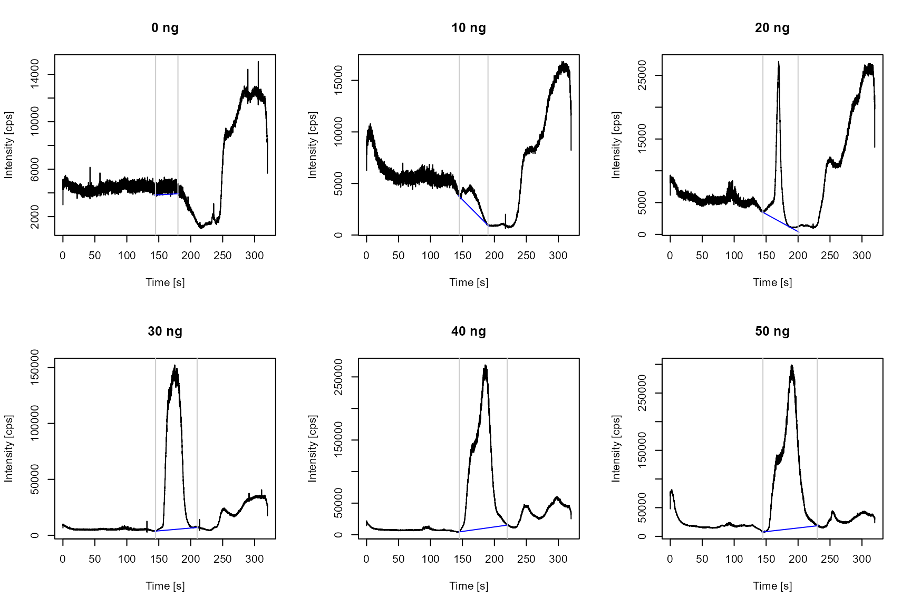

# External calibration (ExtCal) workflow

## Introduction

External calibration with dried liquid standards, matrix-matched
standards or reference materials is a common approach for calibrating
transient signal from ETV/ICP-MS and -OES measurements. Most ETV time
scans do not exceed two peaks per analyte. However, matrix influences on
the acquired isotope or emission line might lead to signal splitting or
an uneven background signal, where peak detection algorithms fail and
manual peak identification is necessary. On the other hand,
co-vaporization of analyte and matrix components alternates the plasma
and thus the signal response. The use of an internal standard allows to
correct for non-linearity and enables accurate analysis.

As an example, we provide the data of fluorine measurements included in
\[paper\].

## Calibration data

### Import

Currently, the import of ICP-MS raw data from four different instrument
types is supported. Additionally, .csv-file from Spectro ICP-OES
instruments can be read in. As an example for the external calibration
workflow, we provide .csv-files aquired *via* an Agilent triple
quadrupole instrument. The output *data.frame* consists of a time column
and additional intensity columns.

``` r
library(ETVapp)
wf <- "ExtCal"
td <- ETVapp::ETVapp_testdata[[wf]]
cali_imp <- td[["Cali"]]
str(cali_imp[1:3])
#> List of 3
#>  $ P19_256_0_mug.csv :'data.frame':  10491 obs. of  2 variables:
#>   ..$ Time: num [1:10491] 0.0513 0.0818 0.1123 0.1428 0.1733 ...
#>   ..$ 157 : num [1:10491] 3734 4708 4780 4403 5298 ...
#>  $ P19_256_10_mug.csv:'data.frame':  10491 obs. of  2 variables:
#>   ..$ Time: num [1:10491] 0.0513 0.0818 0.1123 0.1428 0.1733 ...
#>   ..$ 157 : num [1:10491] 8898 8672 8191 8145 8326 ...
#>  $ P19_256_20_mug.csv:'data.frame':  10491 obs. of  2 variables:
#>   ..$ Time: num [1:10491] 0.0513 0.0818 0.1123 0.1428 0.1733 ...
#>   ..$ 157 : num [1:10491] 8291 8607 9275 7472 8505 ...
```

### Data processing

*ETVapp* provides options for data processing prior to peak evaluation
through two algorithms, internal standardization and Savitzky-Golay
smoothing, respectively. Internal standardization requires two columns
from the input *data.frame* which need to be determined as analyte and
standard column. The smoothing function is directed by the parameter
filter length *fl* which should be an odd integer \>=3. Omitting the
smoothing step can be achieved by setting *fl* = NULL.

``` r
time_col <- "Time"
int_col <- "157"
cali_pro <- process_data(data = cali_imp, c1 = int_col, fl = 9, wf = wf)
str(cali_pro[1:3])
#> List of 3
#>  $ P19_256_0_mug.csv :'data.frame':  10491 obs. of  2 variables:
#>   ..$ Time: num [1:10491] 0.0513 0.0818 0.1123 0.1428 0.1733 ...
#>   ..$ 157 : num [1:10491] 2995 4416 5146 4637 4722 ...
#>  $ P19_256_10_mug.csv:'data.frame':  10491 obs. of  2 variables:
#>   ..$ Time: num [1:10491] 0.0513 0.0818 0.1123 0.1428 0.1733 ...
#>   ..$ 157 : num [1:10491] 6261 8808 9103 7804 8427 ...
#>  $ P19_256_20_mug.csv:'data.frame':  10491 obs. of  2 variables:
#>   ..$ Time: num [1:10491] 0.0513 0.0818 0.1123 0.1428 0.1733 ...
#>   ..$ 157 : num [1:10491] 6156 8846 9315 8104 8063 ...
```

### Peak evaluation

Prior to peak integration, the peak boundaries need to be defined either
manually or *via* a simple algorithm based on a given minimum peak
height. Modified polynomial fitting is implemented for estimating the
baseline. Therefore, an excerpt of the pre-processed data is evaluated
to avoid impact of signal fluctuations. The time window can be adjusted
through the correction factor *cf* which determines the number of data
points used around the detected peak. By default, a linear fitting will
be computed.

However, the parameter *deg* allows the use of specified degrees of
polynomial fitting. In our example, we opted for a manual peak
definition due to additional signals present in the time scan. Peak data
is collected in a *data.frame* and information on the analyte mass are
transferred through the function
[`tab_cali()`](https://janlisec.github.io/ETVapp/reference/tab_cali.md).

``` r
ps <- rep(145, length(cali_pro))
pe <- seq(180, 230, length.out=length(cali_pro))
cf <- 50

cali_peaks <- get_peakdata(
  cali_pro, 
  int_col = int_col,
  PPmethod = "Peak (manual)", 
  peak_start = ps, 
  peak_end = pe
)

cali_peaks <- tab_cali(peak_data = cali_peaks, wf = wf, std_info = seq(0,50,10))
gt::gt(cali_peaks)
```

| Isotope | Start \[s\] | End \[s\] | Area \[cts\] | BLmethod   | Analyte mass \[pg\] |
|---------|-------------|-----------|--------------|------------|---------------------|
| 157     | 145         | 180       | 22769.77     | modpolyfit | 0                   |
| 157     | 145         | 190       | 46895.40     | modpolyfit | 10                  |
| 157     | 145         | 200       | 209828.40    | modpolyfit | 20                  |
| 157     | 145         | 210       | 3468927.98   | modpolyfit | 30                  |
| 157     | 145         | 220       | 7162789.43   | modpolyfit | 40                  |
| 157     | 145         | 230       | 8217598.39   | modpolyfit | 50                  |

Generate baseline data.

``` r
cali_BL <- lapply(1:length(cali_pro), function(i) {
  flt <- (min(which(cali_pro[[i]][,time_col]>=ps[i]))-cf):(max(which(cali_pro[[i]][,time_col]<=pe[i]))+cf)
  ETVapp:::blcorr_col(
    df = cali_pro[[i]][flt, c(time_col, int_col)],
    nm = int_col, 
    BLmethod = "modpolyfit",
    rval = "baseline", 
    amend = "_BL"
  )
})
```

The following code will plot the processed time scans of the selected
calibration standards. The grey vertical lines mark the peak integration
range. The baseline is drawn in \[color\].

``` r
par(mfrow=c(2,3))
for (i in 1:6) {
  plot(cali_pro[[i]], type="l", 
       ylab = "Intensity [cps]", xlab = "Time [s]", main = paste(cali_peaks[i,6], "ng"))
  lines(x = cali_BL[[i]][,c(time_col)], y = cali_BL[[i]][,3], col = "blue")
  abline(v=cali_peaks[i,2:3], col=grey(0.8))
}
```



Peak areas are plotted against the analyte mass. Calibration parameter
obtained through linear regression are provided as output *data.frame*.

``` r
cm <- calc_cali_mod(df = cali_peaks[,c(6,4)], wf = wf)
par(mfrow=c(1,1))
plot(cali_peaks[,c(6,4)])
abline(a = cm[1,3], b = cm[1,1])
```


``` r
gt::gt(cm)
```

| Slope \[cts/pg\] | Slope error \[cts/pg\] | Intercept \[cts\] | Intercept error \[cts\] | R square |
|----|----|----|----|----|
| 187374.1 | 34823.3 | -1496217 | 1054328 | 0.8786115 |

## Sample analysis

File import, data processing and peak evaluation of the sample
measurement is accomplished similar to the calibration measurements.

``` r
smpl_pro <- process_data(data = td[['Sample']][[1]], c1 = int_col, fl = 9, wf = wf)
smpl_peak <- get_peakdata(smpl_pro, PPmethod = "Peak (manual)", BLmethod = "none", int_col = int_col, time_col = time_col, peak_start = 230, peak_end = 320)
gt::gt(smpl_peak)
```

| Isotope | Start \[s\] | End \[s\] | Area \[cts\] | BLmethod |
|---------|-------------|-----------|--------------|----------|
| 157     | 230         | 320       | 889621.4     | none     |

The following code plots the sample time scan with the peak boundaries.

``` r
par(mfrow=c(1,1))
  plot(smpl_pro, type="l", ylab = "Intensity [cps]", xlab = "Time [s]", main = "Sample")
  abline(v=smpl_peak[1,2:3], col=grey(0.8))
```


Compute sample result based on the calibration model with the following
code. The input of a mass fraction allows for result calculation if the
elemental composition of the analyte is not fully captured by the
acquired element,*e.g.* Sn in organo tin compounds or C in micro
plastics.

``` r
gt::gt(tab_result(
  smpl_peak, 
  a = cm[1,3], 
  b = cm[1,1], 
  wf = wf,
  mass_fraction2 = 1, 
  sample_mass = 1
))
```

| Isotope | Start \[s\] | End \[s\] | Area \[cts\] | BLmethod | Analyte mass as element \[pg\] | Sample mass \[mg\] | Content as element \[ppb\] |
|----|----|----|----|----|----|----|----|
| 157 | 230 | 320 | 889621.4 | none | 12.73302 | 1 | 12.73302 |

## Limits of detection and quantification

Blank measurements are imported, processed and plotted as follows. Data
treatment analog to the sample data is recommended.

``` r
blnk_pro <- process_data(data = td[['Blanks']], c1 = int_col, fl = 9, wf = wf)

par(mfrow=c(2,5))
par(mar=c(5,3,0,0)+0.1)
for (i in 1:min(length(blnk_pro), 10)) {
  ylim <- c(0, max(sapply(blnk_pro, function(x) {max(x[,2])})))
  plot(blnk_pro[[i]], type="l", main = names(blnk_pro)[i], ylab="", ylim=ylim)
  abline(v=smpl_peak[1,2:3], col=grey(0.8))
}
```


For estimating the limit of detection (LOD) and quantification (LOQ)
according to the blank value method, integrate the blank signals in the
peak time window.

``` r
blnk_peaks <- get_peakdata(
  blnk_pro, 
  int_col = int_col, 
  time_col = time_col,
  BLmethod = "none",
  peak_start = smpl_peak[,2], 
  peak_end = smpl_peak[,3]
)
gt::gt(blnk_peaks)
```

| Isotope | Start \[s\] | End \[s\] | Area \[cts\] | BLmethod |
|---------|-------------|-----------|--------------|----------|
| 157     | 0.05198     | 320.0285  | 1591587      | none     |
| 157     | 0.05211     | 320.0286  | 2214883      | none     |
| 157     | 0.05206     | 320.0285  | 2029298      | none     |
| 157     | 0.05111     | 320.0276  | 1294937      | none     |
| 157     | 0.05199     | 320.0285  | 1389711      | none     |
| 157     | 0.05102     | 320.0275  | 1704857      | none     |
| 157     | 0.05157     | 320.0280  | 1409494      | none     |
| 157     | 0.05088     | 320.0274  | 1834430      | none     |
| 157     | 0.05102     | 320.0275  | 1638883      | none     |
| 157     | 0.05106     | 320.0275  | 1486251      | none     |
| 157     | 0.05117     | 320.0276  | 1814962      | none     |

The LOD and LOQ are estimated as three and ten times the standard
deviation of the blank values divided by the slope of the linear
calibration curve. At least three input values are required for
statistical evaluation. Less than the recommended 10 entries will still
give a result. The input of a theoretical sample mass will compute the
LOD and LOQ per sample mass.

``` r
gt::gt(tab_LOX(x = blnk_peaks[,4], cali_slope = cm[1,1], wf = wf, mass_fraction2 = 1, sample_mass = 1))
```

| LOD as element \[pg\] | LOQ as element \[pg\] | Sample mass \[mg\] | LOD per sample mass \[ppb\] | LOQ per sample mass \[ppb\] |
|----|----|----|----|----|
| 4.53728 | 15.12427 | 1 | 4.53728 | 15.12427 |
