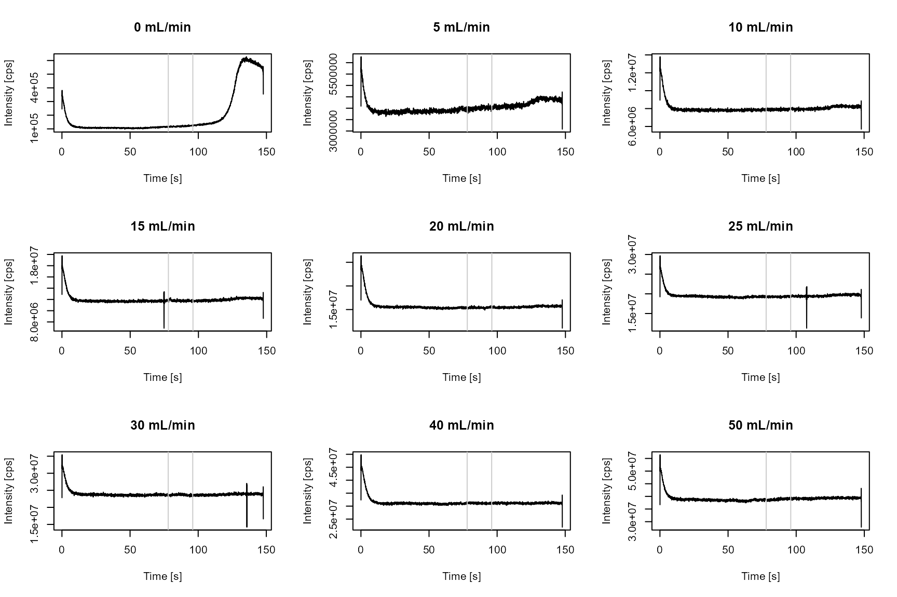
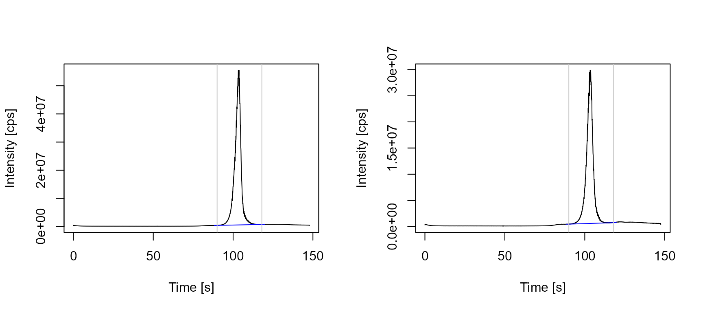
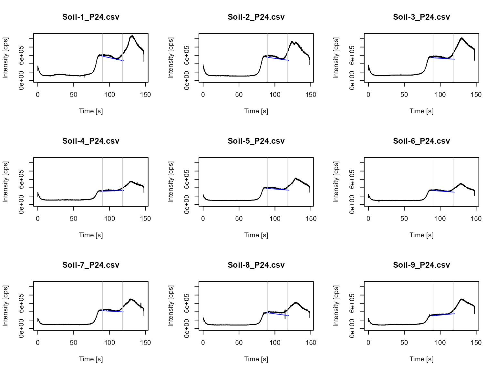

# External gas calibration (ExtGasCal) workflow

## Introduction

External gas calibration is a new approach used in combination with ICP
techniques and has been applied for the determination of microplastics
with [single particle
ICP-MS](https://link.springer.com/article/10.1007/s00216-025-05934-9)
and ETV/ICP-MS.The working principle is based on the introduction of a
dynamically diluted calibration gas into the ICP-MS system.
Consequently, data processing requires calculation of a mean value from
the continuous signal curves.

The workflow external gas calibration (ExtGasCal) is compatible with
ICP-MS or ICP-OES data.

In the package *ETVapp*, we provide the example data of microplastic
measurements. They can be accessed by
`ETVapp::ETVapp_testdata[['ExtGasCal']]`.

``` r
library(ETVapp)
td <- ETVapp::ETVapp_testdata[['ExtGasCal']]
```

## Calibration data

Import the calibration data and check the available isotope intensities
recorded (see column names).

``` r
cali_imp <- td[['Cali']]
str(cali_imp[[1]])
#> 'data.frame':    4258 obs. of  4 variables:
#>  $ Time: num  0.036 0.07 0.105 0.14 0.174 0.209 0.244 0.278 0.313 0.348 ...
#>  $ 13C : num  338127 354037 352302 342715 349956 ...
#>  $ 80Se: num  15591099 15197049 15120592 15045815 15256703 ...
#>  $ 26Mg: num  3900 4000 4100 4401 4000 ...
```

Select the isotope `13C` (parameter *c1*) and set filter length *fl = 9*
for Savitzky-Golay smoothing.
[`process_data()`](https://janlisec.github.io/ETVapp/reference/process_data.md)
provides optional correction with an internal standard (parameter *c2*)
and smoothing could be omitted with `fl=NULL`.

``` r
anlt <- "13C"
time_col <- "Time"
cali_pro <- process_data(data = cali_imp, c1 = anlt, fl = 9, wf = "ExtGasCal")

# observe the intensity modification made by process_data()
gt::gt(head(cbind(
  cali_imp[[1]], 
  setNames(cali_pro[[1]], paste0(" ", colnames(cali_pro[[1]])))
))) |> 
  gt::tab_spanner(label = "processed", columns = 5:6) |> 
  gt::tab_spanner(label = "original", columns = 1:4)
```

[TABLE]

### Signal evaluation

Receive mean signal intensities *via* the peak picking method “mean
signal”. The signal integration range is defined by *peak_start* and
*peak_end*. Gas flows \[mL/min\] are asigned to the signal data with
[`tab_cali()`](https://janlisec.github.io/ETVapp/reference/tab_cali.md).
The parameter *fac* enables the input of a conversion factor, *e.g.* for
mass percentage, molar fractions, when computing the gas flows in µg/s.

``` r
cali_sig <- get_peakdata(
  cali_pro, 
  int_col = anlt, 
  PPmethod = "mean signal",
  peak_start = 78, 
  peak_end = 96
)

gas_flow <- extract_unique_number(names(cali_pro))
fac <- 1.661 * 0.01104347 * 12/44

cali_peaks <- tab_cali(
  peak_data = cali_sig, 
  wf = "ExtGasCal", 
  std_info = gas_flow, 
  fac = fac
)
gt::gt(cali_peaks)
```

| Isotope | Start \[s\] | End \[s\] | Mean Signal \[cps\] | Gas flow \[nL/min\] | Gas flow \[pg/s\] |
|----|----|----|----|----|----|
| 13C | 78 | 96 | 119473.2 | 0 | 0.000000 |
| 13C | 78 | 96 | 4001034.2 | 5 | 0.416891 |
| 13C | 78 | 96 | 7896885.9 | 10 | 0.833782 |
| 13C | 78 | 96 | 11786444.7 | 15 | 1.250673 |
| 13C | 78 | 96 | 15397207.9 | 20 | 1.667564 |
| 13C | 78 | 96 | 19274547.6 | 25 | 2.084455 |
| 13C | 78 | 96 | 23652121.3 | 30 | 2.501346 |
| 13C | 78 | 96 | 31138034.0 | 40 | 3.335128 |
| 13C | 78 | 96 | 38843086.7 | 50 | 4.168910 |

The following code will plot the time scans of the calibration
standards. The evaluated signal range is framed by grey vertical lines.

``` r
par(mfrow=c(3,3))
for (i in 1:9) {
  plot(cali_pro[[i]], type="l", ylab = "Intensity [cps]", xlab = "Time [s]", main = paste(cali_peaks[i,5], "mL/min"))
  abline(v=cali_peaks[i,2:3], col=grey(0.8))
}
```



Peak areas are plotted against the gas flows. Calibration parameter
obtained through linear regression are provided as output *data.frame*.

``` r
cm <- calc_cali_mod(df = cali_peaks[,c(5,4)], wf = "ExtGasCal")
par(mfrow=c(1,1))
plot(cali_peaks[,c(5,4)])
abline(a = cm[1,3], b = cm[1,1])
```


``` r
gt::gt(cm)
```

| Slope \[cps s/pg\] | Slope error \[cps s/pg\] | Intercept \[cps\] | Intercept error \[cps\] | R square |
|----|----|----|----|----|
| 775407.6 | 3458.054 | 100482.6 | 92034.5 | 0.9998608 |

## Sample analysis

Repeat the procedure for the sample data.

``` r
smpl_pro <- process_data(data = td[['Samples']], c1 = anlt, fl = 9, wf = "ExtGasCal")
str(smpl_pro[[1]])
#> 'data.frame':    4258 obs. of  2 variables:
#>  $ Time: num  0.036 0.07 0.105 0.14 0.174 0.209 0.244 0.278 0.313 0.348 ...
#>  $ 13C : num  257688 374319 402399 355778 359845 ...

ps <- 90
pe <- 118
cf <- 50

smpl_peaks <- get_peakdata(
  smpl_pro, 
  int_col = anlt, 
  PPmethod = "Peak (manual)",
  minpeakheight = 1000000,
  peak_start = ps, 
  peak_end = pe
)
gt::gt(smpl_peaks)
```

| Isotope | Start \[s\] | End \[s\] | Area \[cts\] | BLmethod   |
|---------|-------------|-----------|--------------|------------|
| 13C     | 90          | 118       | 227316087    | modpolyfit |
| 13C     | 90          | 118       | 130323678    | modpolyfit |

Generate baseline data from a time scan excerpt and plot the sample time
scan with integration parameter.

``` r
smpl_BL <- lapply(1:length(smpl_pro), function(i) {
  flt <- (min(which(smpl_pro[[i]][,time_col]>=ps))-cf):(max(which(smpl_pro[[i]][,time_col]<=pe))+cf)
  ETVapp:::blcorr_col(
    df = smpl_pro[[i]][flt,c(time_col, anlt)],
    nm = anlt, 
    BLmethod = "modpolyfit",
    rval = "baseline", 
    amend = "_BL")
})
```

``` r
par(mfrow=c(1,2))
for (i in 1:2) {
  plot(smpl_pro[[i]], type="l", ylab = "Intensity [cps]", xlab = "Time [s]")
  lines(x = smpl_BL[[i]][,c("Time")], y = smpl_BL[[i]][,3], col = "blue")
  abline(v=smpl_peaks[i,2:3], col=grey(0.8))
}
```



Compute the sample result based on calibration model with the following
code. The input of a mass fraction allows for result calculation of the
micro plastic content (content as analyte) from the carbon mass (content
as element).

``` r
w_PE <- 0.856
sample_mass = c(0.99, 1.02)

gt::gt(tab_result(
  smpl_peaks, 
  a = cm[1,3], 
  b = cm[1,1], 
  wf = "ExtGasCal",
  mass_fraction2 = w_PE, 
  sample_mass = sample_mass
))
```

| Isotope | Start \[s\] | End \[s\] | Area \[cts\] | BLmethod | Analyte mass as element \[pg\] | Analyte mass \[pg\] | Mass fraction | Sample mass \[mg\] | Content as element \[ppb\] | Content as analyte \[ppb\] |
|----|----|----|----|----|----|----|----|----|----|----|
| 13C | 90 | 118 | 227316087 | modpolyfit | 293.0273 | 342.3216 | 0.856 | 0.99 | 295.9872 | 345.7794 |
| 13C | 90 | 118 | 130323678 | modpolyfit | 167.9416 | 196.1934 | 0.856 | 1.02 | 164.6486 | 192.3465 |

## Limits of detection and quantification

Blank measurements are imported and processed as follows. For estimating
the limit of detection (LOD) and quantification (LOQ) according to the
blank value method, integrate the blank signals in the peak time window.

``` r
blnk_pro <- process_data(data = td[['Blanks']], c1 = anlt, fl = 9, wf = "ExtGasCal")

blnk_BL <- lapply(1:length(blnk_pro), function(i) {
  flt <- (min(which(blnk_pro[[i]][,time_col]>=ps))-cf):(max(which(blnk_pro[[i]][,time_col]<=pe))+cf)
  ETVapp:::blcorr_col(
    df = blnk_pro[[i]][flt,c(time_col, anlt)],
    nm = anlt, 
    BLmethod = "modpolyfit",
    rval = "baseline", 
    amend = "_BL")
})

blnk_peaks <- get_peakdata(
  blnk_pro, 
  int_col = anlt, 
  PPmethod = "Peak (manual)",
  BLmethod = "modpolyfit",
  peak_start = ps, 
  peak_end = pe
)

gt::gt(blnk_peaks)
```

| Isotope | Start \[s\] | End \[s\] | Area \[cts\] | BLmethod   |
|---------|-------------|-----------|--------------|------------|
| 13C     | 90          | 118       | 1187689.2    | modpolyfit |
| 13C     | 90          | 118       | 1341806.9    | modpolyfit |
| 13C     | 90          | 118       | 969971.8     | modpolyfit |
| 13C     | 90          | 118       | 527440.8     | modpolyfit |
| 13C     | 90          | 118       | 645976.3     | modpolyfit |
| 13C     | 90          | 118       | 552234.9     | modpolyfit |
| 13C     | 90          | 118       | 794772.3     | modpolyfit |
| 13C     | 90          | 118       | 1403571.9    | modpolyfit |
| 13C     | 90          | 118       | 594962.9     | modpolyfit |

``` r

par(mfrow=c(3,3))
for (i in 1:min(length(blnk_pro), 10)) {
  ylim <- c(0, max(sapply(blnk_pro, function(x) {max(x[,2])})))
  plot(blnk_pro[[i]], type="l", main = names(blnk_pro)[i], ylab="Intensity [cps]", xlab = "Time [s]",ylim=ylim)
  lines(x = blnk_BL[[i]][,c("Time")], y = blnk_BL[[i]][,3], col = "blue")
  abline(v=blnk_peaks[i,2:3], col=grey(0.8))
}
```



The LOD and LOQ are estimated as three and ten times the standard
deviation of the blank values divided by the slope of the linear
calibration curve. At least three input values are required for
statistical evaluation. Less than the recommended 10 entries will still
give a result. The input of a theoretical sample mass will compute the
LOD and LOQ per sample mass. Figures of merit are provided related to
carbon (measured element) and polyethylene (analyte).

``` r
gt::gt(tab_LOX(x = blnk_peaks[,4], cali_slope = cm[1,1], wf = "ExtGasCal", mass_fraction2 = w_PE))
#> At least ten blank values are recommended for estimating the LOD and LOQ.
```

| LOD as element \[pg\] | LOQ as element \[pg\] | Mass fraction | Sample mass \[mg\] | LOD as analyte \[pg\] | LOQ as analyte \[pg\] | LOD per sample mass \[ppb\] | LOQ per sample mass \[ppb\] |
|----|----|----|----|----|----|----|----|
| 1.343089 | 4.476964 | 0.856 | 1 | 1.569029 | 5.230098 | 1.343089 | 4.476964 |
